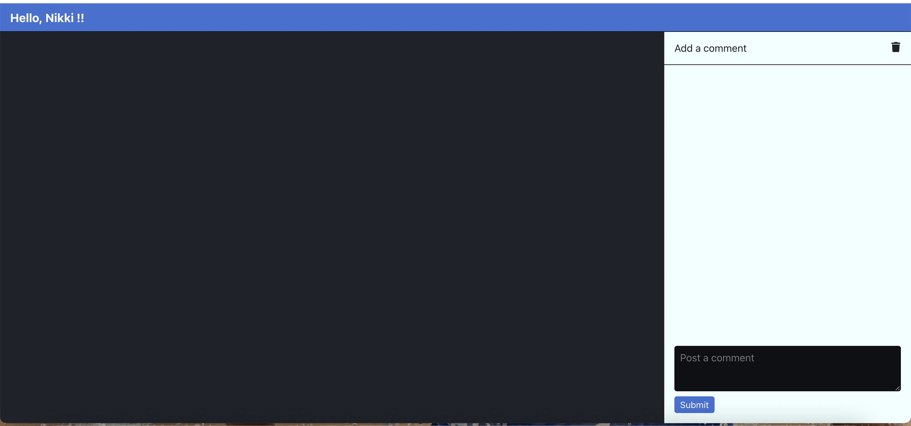
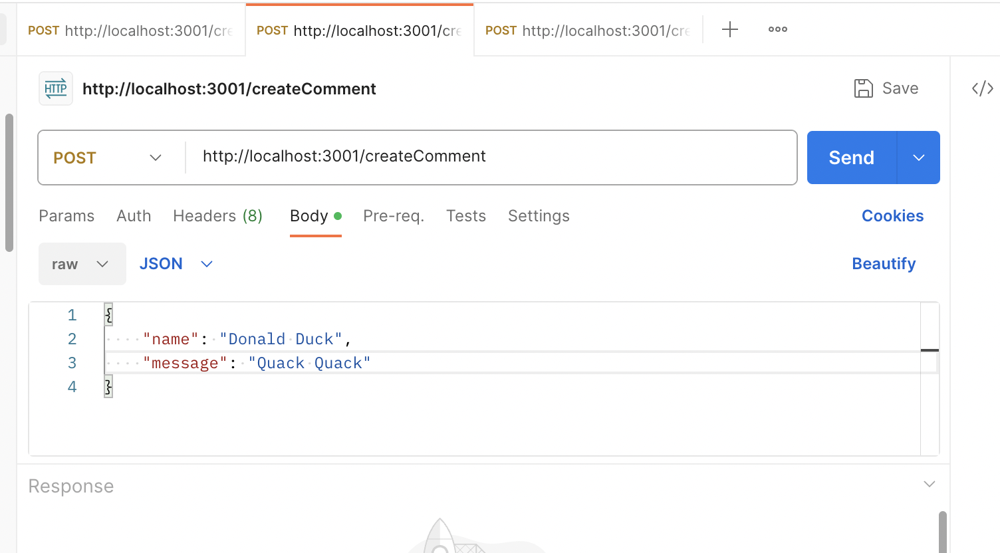
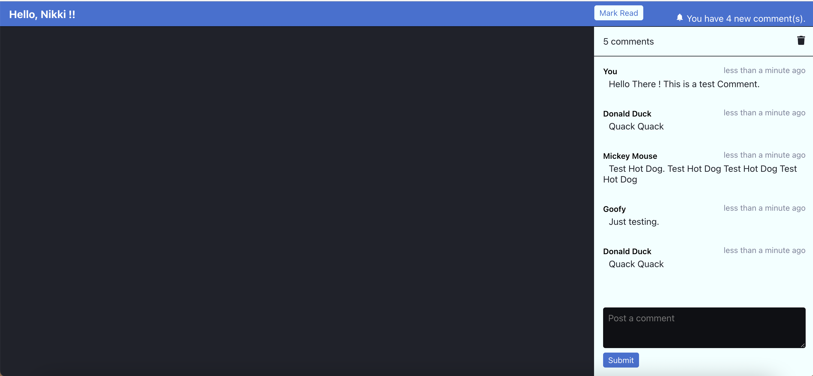

# Front-end Choose Your Own Adventure Take-Home

Welcome to the comments feed application for your application. To use this application, you would need to install the packages before you can run / test the application.

## Installing the application

This project is created using create react app. If you do not have the configuration for a react application, please download these

- **[node js](https://nodejs.org/en/download)**
- **[postman](https://www.postman.com/downloads/)**

### Troubleshooting Installations
1. If you have errors with sqlite for mac, please use this command to download latest stable version of sqlite in your project folder.
  ``` 
  npm uninstall sqlite3  
  npm cache clean
  npm install sqlite3;        
  ```
2. If you have issues with Python or node-gyp, please make sure to download it separately using npm.

### Install & Run in Development

```
$ npm install / npm i
$ npm run dev
```

To install in the front end project 

```
$ cd src/comments-ui
$ npm install / npm i
```

### Test in Development

```
$ npm run test or npm test
```

To test only in the fron end project
```
$ cd src/comments-ui 
$ npm test
```
### Build for production

```
$ npm run build
```

### Using the Application

- Assumption : 
1. User management is not included in this sample project and hence the default user is set as "Nikki".
2. The left side main panel is kept blank as a placeholder for the main CYOA components which the comments feed can support.

- Instructions :

1. To post a comment, please type in to the Comment box and click on the submit button. Once submittied, you should see it in the feed. The view will always scroll to the latest feed in the comments box.
Note : The max input size is 250 characters.
2. To send a comment from a different user, we can test using a postman request, which provides notification to the user in the header and also loads the comments in the feed.
3. The top part of the comment feed mentions the total number of comments in the feed. The trash icon next to it deletes all feeds.
4. Above the Comments section, there is a notification header to display when new comments come in from other users(currently can be tested using postman). The 'Mark Read' button can be used to remove all the notifications.
5. Deleting all comments will also remove all notifications.

UI Snapshot
You should see the application as in this snapshot :
1. Initial Load



2. Use Postman Request to send comments to your application



2. With Comments



